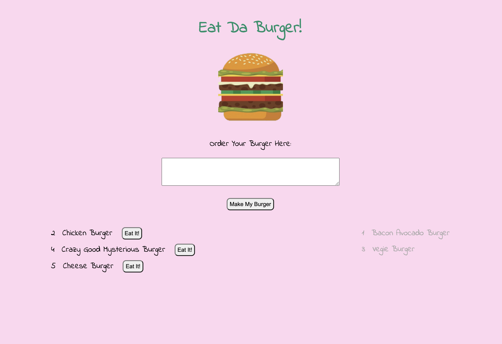

# Eat-Da-Burger

## Description
The Eat-Da-Burger app is a simple web application that allows user to create, read and update data (burgers). The data is then displayed on the client side using a template engine (Handlebars). The purpose of this application is to practice fullstack development and becoming more familiarized with the connection between the two. 

**Technologies used include:**  

Node.js  
express  
mySQL databse  
ORMs  
handlebars  
HTML, CSS, JavaScript, etc

As the codebase becomes more complicated, this application also uses a **MVC (Model View Controller)** paradigm to separate task concerns. 

This project showcases my basic skills to build a functional fullstack application, as well as prepares me for more complicated, team oriented projects in the future.

 

## Usage
App is deployed and ready to use on Heroku:  

https://protected-hollows-24713.herokuapp.com/

